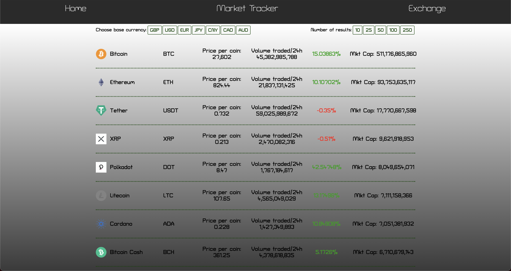

# Crypto-Tracker 📈 (SEI Project 2) :


## Project Overview

This hackathon themed project was my second of the GA bootcamp. I was given 48 hours to build a one page, frontend React application that consumed a public Rest API.

An objective of mine when deciding the concept was to build the type of app that I could see myself working on in industry. I also wanted to tailor the app to my personal interests, and eventually decided to build a cryptocurrency market tracker. It's not as complicated as it sounds, I promise! <br>

### Take a look [here.](https://danieltockan.github.io/Crypto-Tracker/)

This solo-project provided me with an opportunity to improve on the React skills I had developed the week prior, and work with my first external library (Plotly) to plot time-series data.


### Table of Contents

1. [Project Overview](#Project-Overview)
2. [The Brief](#The-Brief)
3. [Technologies Used](#Technologies-Used)
4. [The Approach](#The-Approach)
    - [The API's](#API's-Used)
    - [Planning](#Planning)
    - [Build](#Build)
5. [Triumphs](#Triumphs)
6. [Obstacles Faced and Lessons](#Obstacles-Faced-and-Lessons)
7. [Future Features](#Future-Features)

## The Brief

- Consume a public API.
- Have several components.
- The app should include a router - with several pages.
- Include wireframes.
- Have semantically clean HTML.
- Be deployed online and accessible to the public.

## Technologies Used:

- HTML
- CSS / SCSS
- JavaScript
- React (Hooks)
- Axios
- Insomnia
- Plotly Library
- APIs
  - CoinGecko
  - Alpha Vantage

## The Approach

### The API's

Intent on building an app centred around finance, I conducted a search of API's I could potentially use. The following criteria were considered in my selection process:
- Is it free to use?
- Do I require an API key/is there a call limit?
- Quality of documentation
- Quality of the endpoints returned

Following my research I decided to use [CoinGecko's API](https://www.coingecko.com/en/api). This API scored well across all 4 criteria, providing a comprehensive list of endpoints returning data for live pricing, trading volume, historical data etc. for thousands of cryptocurrnecies. I was satisfied that I had enough data to build out an MVP with.

<!-- - Selected markets endpoint that containes array of objects, each object containing a lot of data for different cryptocurrencies -->


I also came across the [Alpha Vantage API](https://www.alphavantage.co/documentation/) during the research phase of the project. This API was not cryptocurrency focused but provided a lot of useful financial data. Despite requiring an API key, this was another great API that I decided to bookmark for any potential stretch goals.

### Day 1:

The short time-frame meant that strict planning was necessary to get an MVP built in time for my Demo.

Planning (in order):

- Research API's (see above)
- Define and plan MVP
- Define stretch goals
- Determine how I would fetch the relevent data to build an MVP
- Build out MVP components
- Style MVP components
- Debugging and implementation of stretch goals

**Defining MVP**

Defining an MVP was relatively simple given the wealth of information provided by the CoinGecko API. I used the endpoint "coins/markets", which returned an array of objects. Each object returned several fields of data related to a specific coin:


This information was perfect to make a crypto market tracker, ranking coins in terms of market cap. All datapoints that I wanted would be displayed in a row, with each coin having its own row. <br>

To illustrate:


Detials on how this was achieved is given in [Build](#Build).

**Stretch goals**

The majority of effort spent on this project was in the implemention of my stretch goals. In no particular order, these were to:

- Incorporate pagination, allowing client-side to select the number of results returned
- Add buttons to toggle the currency that numerical data was displayed in
- Create an additional page, for currency exchange (crypto and fiat)
- Create an individual coin page providing details on each currency - required me to fetch deeply nested data
- Create a chart displaying time series data of historical prices (in individual coin page)

### Build:

Each section/page of the app was stored within its own component: 

- Home.js (MVP)
- Navbar.js (MVP)
- CryptoTracker.js (MVP)
- CurrencyConverter.js (Stretch)
- Coin.js (Stretch)

And then imported to the App.js file, like so:

```js
import Home from './components/Home'
import Navbar from './components/Navbar'
import CryptoTracker from './components/CryptoTracker'
import CurrencyConverter from './components/CurrencyConverter'
import Coin from './components/Coin'
```

React Router was used to navigate between the components.

```js
const App = () => {
  return <BrowserRouter>
    <Navbar />
    <Switch>
      <Route exact path="/" component={Home} />
      <Route exact path="/Tracker" component={CryptoIndex} />
      <Route exact path="/Tracker/:coinId" component={Coin} />
      <Route exact path="/Exchange" component={CurrencyConverter} />
    </Switch>
  </BrowserRouter>
}

export default App
```


#### Coin Tracker



The crypto tracker was rendered onto page using map function. The data fioelds that I wanted to display were input and styled.

```js
{crypto.map((crypto, index) => {
          return <div className="tracker" key={index}>
            <Link
              className="remove-hyperlink"
              to={`/crypto-tracker/${crypto.id}`}>
              <div className="coin-row">
                <div className="coin">
                  
                  <h1 className="coin-name">{crypto.name}</h1>
                  <p className="ticker">{crypto.symbol.toUpperCase()}</p>
                </div>
                <div className="coin-details">
                  <p className="coin-price">Price per coin: {crypto.current_price.toLocaleString()}</p>
                  <p className="volume">Volume traded/24h  {crypto.total_volume.toLocaleString()}</p>
                  {crypto.price_change_percentage_24h < 0 ? (
                    <p className="price-change red">{crypto.price_change_percentage_24h.toFixed(2)}%</p>
                  ) :
                    (<p className="price-change green">{crypto.price_change_percentage_24h}%</p>)}
                  <p className="market-cap">Mkt Cap: {crypto.market_cap.toLocaleString()}</p>
                </div>
              </div>
            </Link>
          </div>

        })}
```

Each coin was an object within an array retunred from the API, and as a result had its own row.

Use Effects (axios) were utilised to fetch the data from the API.

```js
  useEffect(() => {
    axios.get(`https://api.coingecko.com/api/v3/coins/markets?vs_currency=${baseCurrency}&order=market_cap_desc&per_page=${resultsPerPage}&page=1&sparkline=false`)
      .then(resp => {
        const data = resp.data
        updateCrypto(data)
      })
  }, [baseCurrency, resultsPerPage])
  ```

State was used to dynamically update the data rendered on the page.

```js
  const [crypto, updateCrypto] = useState([])
  const [baseCurrency, updateBaseCurrency] = useState('GBP')
  const [resultsPerPage, updateResultsPerPage] = useState('100')
  ```

The use of state allowed me to make add buttons that toggled the number of results shown on the page, and the currency in which prices were displayed in. The state was updated within the useEffect, and triggered a new fetch each time state was updated.


An event listener was implemented within each button, updating the state everytime the corresponding button was clicked, like so:

```js
<div className="header-button"
  onClick={(event) => updateBaseCurrency(event.target.value)}>
  <h5>Choose base currency:</h5>
  <button value="GBP">GBP</button>
  <button value="USD">USD</button>
  <button value="EUR">EUR</button>
  <button value="JPY">JPY</button>
  <button value="CNY">CNY</button>
  <button value="CAD">CAD</button>
  <button value="AUD">AUD</button>
</div>
```


<!-- Links added to each row leading to individual coin page

Used turnary to show +ve price change as green and -ve as red


#### Indvidual Coin Page

Graph created from plotly lbrary charted using time series data of past 30 day prices

More details on each coin, including bio section added

Accesed deeply nester data using destructuring -->

#### Currency Converter

Working currency converter added using AlphaVantage API

Created use state to update each currency and get the rate

Created logic based function to get correct offer and quote prices


## Triumphs

- Successfully created a time seriess plot using external plotly library.
- The price data updated dynamically wuth the press of a button, similarly to how it does on poular websites.


## Obstacles Faced and Lessons

- I experienced major bugs when trying to access deeply nested data. Having conducted extensive research, I was able to solve this problem on my won. This improved my debugging skills as well as my ability to use more complex API's.

## Future Features

- I am currently working on a single coin page, that provides extensive details on each indivudal coin. It will be accessed by clicking on the coin within the coin tracker.
