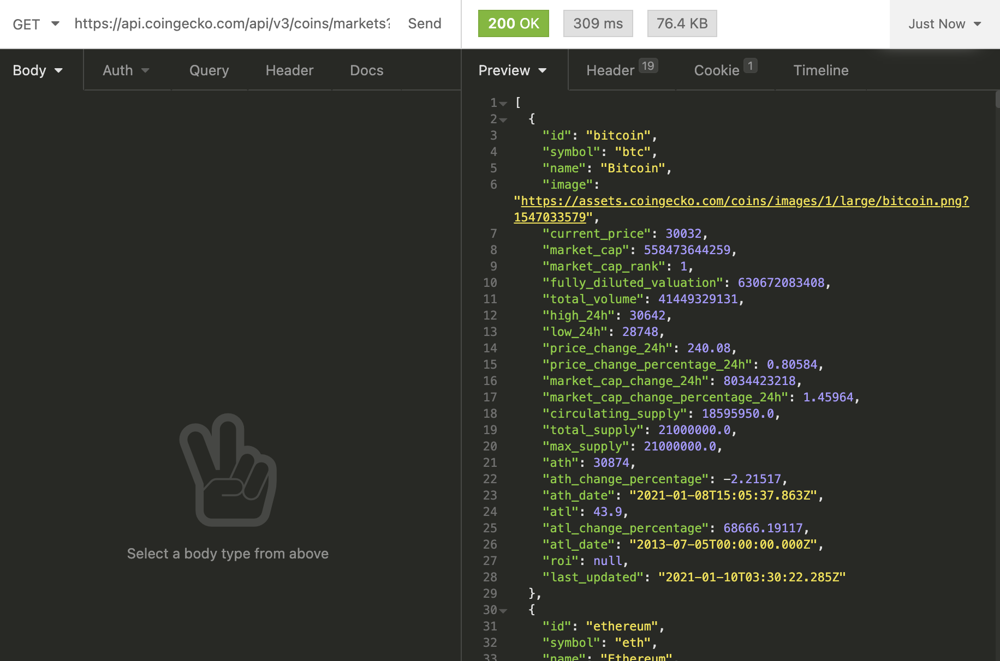

# Crypto-Index (SEI Project 2)

## Project Overview

This was a hackathon themed project, lasting 3 days with the objective of building a frontend React application that consumed a public Rest API. I had 48-hours to complete the app.

### Table of Contents

1. [Project Overview](#Project-Overview)
2. [The Brief](#The-Brief)
3. [Technologies Used](#Technologies-Used)
4. [The Approach](#The-Approach)
    - [Planning](#Planning)
    - [API's Used](#API's-Used)
    - [React](#React)
5. [Triumphs](#Triumphs)
6. [Obstacles Faced and Lessons](#Obstacles-Faced-and-Lessons)
7. [Future Features](#Future-Features)

## The Brief

- Consume a public API.
- Have several components - Classical or functional.
- The app should include a router - with several "pages".
- Include wireframes.
- Have semantically clean HTML.
- Be deployed online and accessible to the public.

## Technologies Used:

- HTML
- CSS / SCSS
- JavaScript
- React (Hooks)
- Axios
- Insomnia
- Plotly Library
- APIs
  - CoinGecko
  - Alpha Vantage

## The Approach

- Wanted an app based around finance/investing with constantly updating live data feeds

- Coingecko selected due to easy to use API, with a lot od end points and did not require a key

- Selected markets endpoint that containes array of objects, each object containing a lot of data for different cryptocurrencies

- Was satisfied that there was enough data to build an app with, as hundereds of coins with roguhly 30 fields each were returned

### Planning:

The short time-frame meant that strict planning was necessary to get an MVP built in time for Demos

Day 1 (in order)

-  Conduct some research on the API's I was going to use
- Determine how I would fetch the relevent data I needed from them
- Determine my MVP
- Determine stretch goals
- Build out the MVP components
- Style MVP components

Given the amount of numerical data relating to finance I decided my MVP would be a cryptocurrency stock index

One stretch goal was to add pagination

One stretch goal was to toggle prices and data in different currencies

One stretch goal was to add a currency working exchange converter

One stretch goal was to add a single coin page

One stretch goal was to access deeply nested data from API

One stretch goal was to build time series chart of historical data

### React:

#### Coin Index

Crypto-Index render onto page using map function

Created a row of data fields I wanted

Use State and use effects and axios to fetch the data

Pagination achieved by embedding number of results per page, clicking on button set this within fetch URL using state

Links added to each row leading to individual coin page

#### Indvidual Coin Page

Graph created from plotly lbrary charted using time series data of past 30 day prices

More details on each coin, including bio section added

Accesed deeply nester data using indexing

#### Currency Converter

Working currency converter added using alpha vantage API

Created use state to update each currency and get the rate

Created logic based function to get correct offer and quote prices

## Triumphs

Successfully created a time seriess plot using external plotly kivrary

My home page looks like a legitate stock index

## Obstacles Faced and Lessons

Getting the individual coin page to style the way I like. Next time will use a framewoerk like bootstrap

Accessing deeply nested info

## Future Features