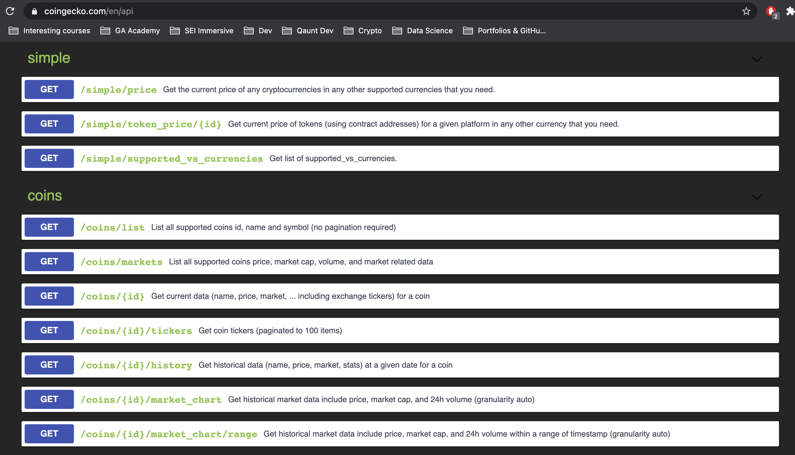

# Crypto-Tracker 📈 (SEI Project 2) :


## Project Overview

This hackathon themed project was my second of the GA bootcamp. I was given 48 hours to build a one page, frontend React application that consumed a public Rest API.

An objective of mine when deciding the concept was to build the type of app that I could see myself working on in industry. I also wanted to tailor the app to my personal interests, and eventually decided to build a cryptocurrency market tracker. It's not as complicated as it sounds, I promise! <br>

### Take a look [here.](https://danieltockan.github.io/Crypto-Tracker/)

This solo-project provided me with an opportunity to improve on the React skills I had developed the week prior, and work with my first external library ([Plotly](https://plotly.com/javascript/)) to plot time-series data.


### Table of Contents

1. [Project Overview](#Project-Overview)
2. [The Brief](#The-Brief)
3. [Technologies Used](#Technologies-Used)
4. [The Approach](#The-Approach)
    - [The API's](#API's-Used)
    - [Planning](#Planning)
    - [Build](#Build)
5. [Triumphs](#Triumphs)
6. [Obstacles Faced and Lessons](#Obstacles-Faced-and-Lessons)
7. [Future Features](#Future-Features)

## The Brief

- Consume a public API
- Have several components
- The app should include a router - with several pages
- Include wireframes
- Have semantically clean HTML
- Be deployed online and accessible to the public

## Technologies Used:

- HTML
- CSS / SCSS
- JavaScript
- React (Hooks)
- Axios
- Insomnia
- Plotly Library
- APIs
  - CoinGecko
  - Alpha Vantage

## The Approach

### The API's

Intent on building an app centred around finance, I conducted a search of API's I could potentially use. The following criteria were considered in my selection process:
- Is it free to use?
- Do I require an API key/ is there a call limit?
- Quality of documentation
- Quality of the endpoints returned

Following my research I decided to use [CoinGecko's API](https://www.coingecko.com/en/api). This API scored well across all 4 criteria, providing a comprehensive list of endpoints returning data for live pricing, trading volume, historical data etc. for hundreds of cryptocurrnecies. I was satisfied that I had enough data to build out an MVP with.

<!-- - Selected markets endpoint that containes array of objects, each object containing a lot of data for different cryptocurrencies -->



I also came across the [Alpha Vantage API](https://www.alphavantage.co/documentation/) during the research phase of the project. This API was not cryptocurrency focused but provided a lot of useful financial data. Despite requiring an API key, this was another great API that I decided to bookmark for any potential stretch goals.

### Day 1:

The short time-frame meant that strict planning was necessary to get an MVP built in time for my Demo.

Planning (in order):

- Research API's (see above)
- Define and plan MVP
- Define stretch goals
- Determine how I would fetch the relevent data to build an MVP
- Build out MVP components
- Style MVP components
- Debugging and implementation of stretch goals

**Defining MVP**

Defining an MVP was relatively simple given the wealth of information provided by the CoinGecko API. I used the endpoint "coins/markets", which returned an array of objects. Each object returned several fields of data related to a specific coin:


This information was perfect to make a crypto market tracker, ranking coins in terms of market cap. All datapoints that I wanted would be displayed in a row, with each coin having its own row. <br>

To illustrate:


Detials on how this was achieved is given in [Build](#Build).

**Stretch goals**

The majority of effort spent on this project was on the implemention of my stretch goals. In no particular order, these were to:

- Incorporate pagination, allowing client-side to select the number of results returned
- Add buttons to toggle the currency that numerical data was displayed in
- Create an additional page, for currency exchange (crypto and fiat)
- Create an individual coin page providing details on each currency - required me to fetch deeply nested data
- Create a chart displaying time series of historical data (in individual coin page)
- Redesign the home page to display the top 5 coins via an automated carousel

### Build:

Each section/page of the app was stored within its own component: 

- Home.js (MVP + Stretch)
- Navbar.js (MVP)
- CryptoTracker.js (MVP)
- Exchange.js (Stretch)
- Coin.js (Stretch)

And then imported to the App.js file, like so:

```js
import Home from './components/Home'
import Navbar from './components/Navbar'
import CryptoTracker from './components/CryptoTracker'
import Exchange from './components/Exchange'
import Coin from './components/Coin'
```

React Router was used to navigate between the components.

```js
const App = () => {
  return <BrowserRouter>
    <Navbar />
    <Switch>
      <Route exact path="/crypto-tracker/exchange" component={Exchange} />
      <Route exact path="/crypto-tracker/all" component={CryptoTracker} />
      <Route exact path="/crypto-tracker/:coinId" component={Coin} />
      <Route exact path="/crypto-tracker" component={Home} />
    </Switch>
  </BrowserRouter>
}

export default App
```

#### Crypto Tracker


The crypto tracker was rendered onto page using a map function. The data fields that I wanted to display were input and styled.

I made use of a ternary operator to apply the class "green" when there was a positive price change over a 24h period, and the class "red" for a negative price change over the same period.

```js
{crypto.map((crypto, index) => {
          return <div className="tracker" key={index}>
            <Link
              className="remove-hyperlink"
              to={`/crypto-tracker/${crypto.id}`}>
              <div className="coin-row">
                <div className="coin">
                  
                  <h1 className="coin-name">{crypto.name}</h1>
                  <p className="ticker">{crypto.symbol.toUpperCase()}</p>
                </div>
                <div className="coin-details">
                  <p className="coin-price">Price per coin: {crypto.current_price.toLocaleString()}</p>
                  <p className="volume">Volume traded/24h  {crypto.total_volume.toLocaleString()}</p>
                  {crypto.price_change_percentage_24h < 0 ? (
                    <p className="price-change red">{crypto.price_change_percentage_24h.toFixed(2)}%</p>
                  ) :
                    (<p className="price-change green">{crypto.price_change_percentage_24h}%</p>)}
                  <p className="market-cap">Mkt Cap: {crypto.market_cap.toLocaleString()}</p>
                </div>
              </div>
            </Link>
          </div>

        })}
```

Each coin was an object within an array retunred from the API, and as a result had its own row with identical styling.

A use Effects hook (axios) was utilised to fetch the data from the API.

```js
  useEffect(() => {
    axios.get(`https://api.coingecko.com/api/v3/coins/markets?vs_currency=${baseCurrency}&order=market_cap_desc&per_page=${resultsPerPage}&page=1&sparkline=false`)
      .then(resp => {
        const data = resp.data
        updateCrypto(data)
      })
  }, [baseCurrency, resultsPerPage])
  ```

State was used to dynamically update the data rendered on the page.

```js
  const [crypto, updateCrypto] = useState([])
  const [baseCurrency, updateBaseCurrency] = useState('GBP')
  const [resultsPerPage, updateResultsPerPage] = useState('100')
  ```

The use of state allowed me to add buttons that toggled the number of results shown on the page, and the currency in which prices were displayed in. The state was updated using an event listener embedded within the buttons. Each time the state updated, a new fetch was triggered within the useEffect due to the arguments passed in the parentheses at the end of the hook.


"onClick" was used to execute this like so:

```js
<div className="header-button"
  onClick={(event) => updateBaseCurrency(event.target.value)}>
  <h5>Choose base currency:</h5>
  <button value="GBP">GBP</button>
  <button value="USD">USD</button>
  <button value="EUR">EUR</button>
  <button value="JPY">JPY</button>
  <button value="CNY">CNY</button>
  <button value="CAD">CAD</button>
  <button value="AUD">AUD</button>
</div>
```

As can be seen within the mapping fucntion above, a link was added to each row directing the user to a page for that individual coin.

#### Home page - automated carousel

Initially (as part of the MVP) the homepage was a condensed version of the coin tracker page (see above), displaying the top 5 coins. However, as this was achieved early on in the project, I began to implement my stretch goal.

This kept with the theme of listing the 5 top coins, however, displaying them via an automated carousel.


A map function was used to render the coins name and symbol, along with buttons navigating to the next coin in the array.

```js
      {crypto && crypto.map((crypto, index) => {
        return <div
          style={{ transform: `translateX(${x}%)` }}
          key={index}
          className="slide">
          <Link
            className="remove-hyperlink"
            to={`/crypto-tracker/${crypto.id}`}>
            
          </Link>
          <Link
            className="remove-hyperlink"
            to={`/crypto-tracker/${crypto.id}`}>
            <div><h1 className="h-coin" >{crypto.id}</h1></div>
          </Link>
        </div>
      })}
      <button id="goLeft" onClick={goLeft} >{arrowL}</button>
      <button id="goRight" onClick={goRight} >{arrowR}</button>
```

The "onClick" event listener was applied to both buttons, triggering the "goLeft" and "goRight" functions handling the navigation.

```js
  const goLeft = () => {
    x === 0 ? updateX(-100 * (crypto.length - 1)) : updateX(x + 100)
  }

  const goRight = () => {
    x === -100 * (crypto.length - 1) ? updateX(0) : updateX(x - 100)
  }
```
To automate the carousel, I created the function "slide" using conditional logic dictating how the carousel would loop throught the array:

```js
  const slide = () => {

    if (x > -400) {
      updateX(x - 100)
    } else {
      updateX(0)
    }
  }
```

Next, I put "slide: within a setinterval that triggered it at my chosen frequency:

```js
const autoSlide = setInterval(slide, 9000)
```

"autoSlide" was then passed within the parentheses of the useEffect, automating the carousel.

```js
  useEffect(() => {
    axios.get(`https://api.coingecko.com/api/v3/coins/markets?vs_currency=GBP&order=market_cap_desc&per_page=5&page=1&sparkline=false`)
      .then(resp => {
        const data = resp.data
        updateCrypto(data)
        updateLoading(false)
      })
  }, [autoSlide])
```

#### Indvidual Coin Page

The individual coin page acted as an individual wiki page for each currency, providing key stats and information specific to the coin. Creating this page required two different endpoints.

The below endpoint gathered the majority of the data found on the page:

```js
  useEffect(() => {
    axios.get(`https://api.coingecko.com/api/v3/coins/${coinId}?localization=false&tickers=false&market_data=true&community_data=false&developer_data=true&sparkline=false`)
      .then(res => {
        const data = res.data
        setCoin(data)
        setLoading(false)
      })
  }, [])
```

The "coinId" string literal within the url was obtained from the link of the coin being clicked on, and directed the router to the corresponding endpoint.


I added a time series chart to the page (using [Plotly](https://plotly.com/javascript/)), displaying historical data relating to:

- Price
- Market cap
- 24h trading volume

Having all three series on one chart required customisation. As with the tracker, buttons were added allowing the user to toggle the currency and time range displayed.

I fetched this data using the "coins/{id}/markets-charts" endpoint:

```js

  useEffect(() => {
    axios.get(`https://api.coingecko.com/api/v3/coins/${cryptoCurrency}/market_chart?vs_currency=${baseCurrency}&days=${dayRange}&interval=daily`)
      .then(resp => {
        const data = resp.data
        setPriceData(data.prices)
        setMCapData(data.market_caps)
        setVolData(data.total_volumes)
      })
  }, [baseCurrency, cryptoCurrency, dayRange])
```

All three data sets required manipulation before they were in a format that the library could use.


I created three identical functions to extract the X and Y co-ordinates, allowing me to plot the charts. 

To illustrate using price:

```js
  // X & Y co-ordinates for price data
  const priceX = priceData.map(price => {
    return price[0]
  })
  const priceY = priceData.map(price => {
    return price[1]
  })
```

I then created an object with the relevent fields as per the libraries documentation:

```js
  const price = {
    x: priceX,
    y: priceY,
    type: 'scatter',
    mode: 'lines',
    name: 'Price',
    marker: { color: 'green' }
  }
```

I finally passed the objects as arguemnts to the plot within the JSX:

```js
<Plot
  data={[price, mCap, vol]}
  layout={{
    width: 720, height: 420, title: `${baseCurrency} vs ${coin.symbol.toUpperCase()} ${dayRange} day time series <br> (Press key to toggle view) `,
    yaxis: { range: [0, priceY] }, xaxis: { type: 'date' }
  }} />
```

#### Exchange

An additional feature I included within the app was a currency convrter, allowing the user to exchange a select group of cryptocurrencies or foregin currency. 


The exchnage rate data was obtained using the [Alpha Vantage API](https://www.alphavantage.co/documentation/).

```js
  const fetch = (currency2) => {
    updateExchangeRate("Loading ...")
    axios.get(`https://www.alphavantage.co/query?function=CURRENCY_EXCHANGE_RATE&from_currency=${baseCurrency}&to_currency=${currency2}&apikey=PKAPG80ELUH9O8CR`)
      .then(resp => {
        updateExchangeRate(resp.data["Realtime Currency Exchange Rate"]["5. Exchange Rate"])
      })
  }
```

Event listeners were used to update the input and dropdown selection fields withing the converter. I then carried out the below mathematical operation using the exchange rate returned from the API and the amount I input to give me the price:

```js
<div><h2>The price is: {exchangeRate === 'Loading ...' ? 'Loading ...' : (exchangeRate * amount).toFixed(2)}</h2></div>
```

## Triumphs

- Successfully created a time seriess plot using external plotly library.
- The price data updated dynamically wuth the press of a button, similarly to how it does on poular websites.


## Obstacles Faced and Lessons

- I experienced major bugs when trying to access deeply nested data. Having conducted extensive research, I was able to solve this problem on my won. This improved my debugging skills as well as my ability to use more complex API's.

## Future Features

- I am currently working on a single coin page, that provides extensive details on each indivudal coin. It will be accessed by clicking on the coin within the coin tracker.
